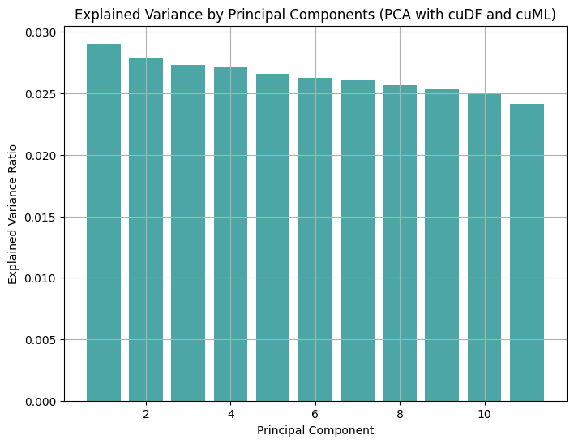
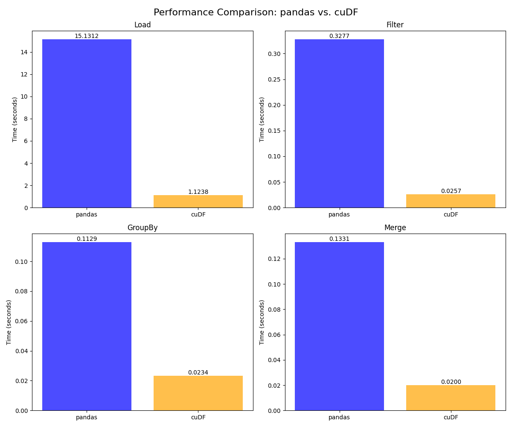

<link rel="stylesheet" href="styles.css">

# RAPIDS cuDF: Accelerating Data Processing with CUDA

## Introduction
In today's world, where data is everywhere, data scientists often struggle to process massive datasets efficiently. With information growing at an incredible pace, traditional CPU-based tools like pandas can start to feel sluggish, making data analysis a time-consuming task. That's where RAPIDS cuDF comes in—a powerful tool that taps into the speed of NVIDIA GPUs to make data manipulation a breeze.

RAPIDS cuDF is a GPU-accelerated DataFrame library that works a lot like pandas, so if you're familiar with pandas, you'll feel right at home. The big difference is that cuDF uses the parallel processing power of GPUs, which can make everyday tasks like loading, joining, aggregating, and filtering data much faster. In fact, [recent tests](https://developer.nvidia.com/blog/rapids-cudf-accelerates-pandas-nearly-150x-with-zero-code-changes/) show that cuDF can speed up pandas workflows by as much as 150 times, and the best part is that you don’t need to change a single line of code.

In this article, we’ll explore what makes cuDF so powerful and how it can transform the way you handle data. We’ll look at its ability to manage datasets that are too big to fit into memory, how well it integrates with the broader RAPIDS ecosystem, and how it can help you get insights from your data much faster. Whether you're working on real-time analytics, prepping data for machine learning, or exploring large datasets, cuDF offers a robust toolkit to take your data science projects to the next level.


## Installation & Setup  

### Getting Started with RAPIDS cuDF  

Installing and configuring RAPIDS cuDF involves a few key steps to get your system ready for GPU-accelerated data processing.  

---

### Prerequisites  

Before installing cuDF, ensure you have:  

- **NVIDIA GPU:** Compute capability 6.0 or higher (Pascal architecture or newer)  
- **CUDA Toolkit:** Version 11.x or 12.x installed  
- **Operating System:** Compatible Linux distribution (Ubuntu recommended) or Windows 11 with WSL2  
- **Python:** Python 3.8 or newer  

---

### Installation Methods  

#### 1. **Google Colab (Easiest Method)**  

If you're using Google Colab, cuDF comes pre-installed on GPU instances:  

- Select a **GPU runtime** in Colab:  
  *Runtime > Change runtime type > Hardware accelerator > GPU*  

- Import cuDF directly:  

```python
import cudf
import numpy as np

df = cudf.DataFrame({'a': np.random.randint(0, 100, size=5)})
print(df.head())
```

#### 2. **PIP Installation**  
For running cuDF locally, you can install cuDF using pip - 

```bash
# Ensure the correct CUDA version is installed (e.g., CUDA 11.x or 12.x)
# RAPIDS cuDF currently supports Python <= 3.11 (Python 3.13 is not supported)
pip install cudf-cu11 dask-cudf-cu11 --extra-index-url=https://pypi.nvidia.com
```

*Tip - Make sure to replace cu11 by the appropriate CUDA driver version on your system.* 

If needed, you can create a new enviornment with compatible version of python in the below way - 

```bash
conda create -n cudf_env python=3.10
conda activate cudf_env
```


#### 3. **Conda Installation**  
For a full RAPIDS setup, using conda is recommended -

```bash
# Install Miniconda or Anaconda first
# Then create a new conda environment and install RAPIDS
conda create -n rapids-23.02 -c rapidsai -c nvidia -c conda-forge \
    rapids=23.02 python=3.8 cudatoolkit=11.8

# Activate the environment
conda activate rapids-23.02
```

***Configuring Jupyter Notebook for RAPIDS*** - 
To use any RAPIDS library within Jupyter Notebook, you need to add the enviornment as a kernel - 

```bash
# Install Jupyter Notebook for this enviornment separately
conda install -c conda-forge notebook ipykernel

# Add the new environment to Jupyter
python -m ipykernel install --user --name=rapids-22.10 --display-name="RAPIDS"
```

After running this, you should be able to select the **"RAPIDS"** kernel in Jupyter Notebook and then you can start using any RAPIDS library within your ipynb file.


---
### Configuration
After the installation, follow these steps to verify and configure cuDFL

**Verifying Installation**

Run the following code in python in order to verify installation - 
```python
import cuDF
print(cudf.__version__)
```

**Set Enviornment Variables**

- **CUDA_VISIBLE_DEVICES=0**: Specify which GPU to use (run the following code in a bash terminal with conda enviornment activated).
```bash
# Use the GPU 0
export CUDA_VISIBLE_DEVICES=0
```

- **LIBCUDF_CUFILE_POLICY**: Control GPUDirect Storage behavior. Run the following code in the abovementioned enviornment.

```bash
export LIBCUDF_CUFILE_POLICY=OFF
```

For multi-GPU setups, you can select a specific GPU using (add the following snippet in your python code):

```python
import os
os.enviorn['CUDA_VISIBLE_DEVICES'] = '0' #Selects GPU 0
```

By following the above steps, you should have a working cuDF installation ready for GPU-accelerated data processing.


## Key Features & Explanation
Now that we are all set-up with the basics, let's get started with the core features of RAPIDS cuDF:

1.. GPU-Accelerated DataFrame Operations -
One of the standout features of cuDF is its ability to use the parallel processing power of NVIDIA GPUs, resulting in 10–150x faster tabular data processing compared to traditional pandas.

```python
import cudf
import numpy as np

nr = 10000000
df = cudf.DataFrame({
    'key': np.random.randint(0,10,nr),
    'value': np.random.random(nr)
})

lookup = cudf.DataFrame({
    'key': range(10),
    'lookup': cp.random.random(10)
})

%time df.merge(lookup,on='key')

pdf = df.to_pandas()
plookup = lookup.to_pandas()
%time pdf.merge(plookup,on='key')
```

```
CPU times: user 23.3 ms, sys: 4.05ms, total: 27.3 ms
Wall time: 27.2 ms
CPU times: user 564 ms, sys: 197 ms, total: 761 ms
Wall time: 756 ms
```

2.. Pandas API Compliance -
One of the most attractive aspects of cuDF is its pandas-like API, which ensures a smooth transition for developers familiar with pandas. The API compliance minimizes the learning curve and allows existing codebases to adopt cuDF with zero to minimal code changes. (No need to rewrite entire codebases, just switch the import statements and enjoy gpu acceleration)

```python
import pandas as pd
import cudf

# Traditional pandas DataFrame
pdf = pd.DataFrame({'col1': [1, 2, 3], 'col2': [4, 5, 6]})
# Convert to cuDF DataFrame
gdf = cudf.DataFrame.from_pandas(pdf)
print(gdf)
```

3.. Unified Memory Architecture -
cuDF leverages a Unified Memory Architecture, offering:
- A single address space that spans both CPU and GPU.
- Automatic data migration between CPU and GPU as needed.
- The ability to handle virtual memory allocations larger than the physical GPU memory.

This approach enables up to 30x speedups on large datasets compared to CPU-only processing, especially useful for out-of-core operations.

4.. Integration with Machine Learning Workflows -
cuDF integrates seamlessly with GPU-accelerated machine learning libraries, particularly cuML, which is part of the broader RAPIDS ecosystem.

Key Advantages:
- Maximize Compatibility: cuML's Scikit-learn-based API design allows users to port existing NumPy, Scikit-learn, and PyData workflows with minimal effort.

- Maximize Performance: By keeping data in GPU memory, cuML achieves peak performance while processing data.

**Example**: Dimentionality Reduction using PCA
The following example demonstrates how to use PCA with cuML on GPU-accelerated dataframes.

```python
from cuml.decomposition import PCA
import cudf
import numpy as np
from matplotlib import pyplot as plt

data = cudf.DataFrame({
    f'feature{i}': np.random.rand(1000) for i in range(50)
})

pca = PCA(n_components=11)
pca_transformed = pca.fit_transform(data)

pca_df = cudf.DataFrame(pca_transformed,columns=[f'PC{i}' for i in range(11)])
plt.figure(figsize=(8, 6))
plt.bar(range(1, 12), pca.explained_variance_ratio_.to_pandas(), color='teal', alpha=0.7)
plt.title('Explained Variance by Principal Components (PCA with cuDF and cuML)')
plt.xlabel('Principal Component')
plt.ylabel('Explained Variance Ratio')
plt.grid(True)
plt.show()
```




5.. Enhanced String and Time Series Processing -
RAPIDS cuDF excels in processing string data and time series analysis, providing robust tools to handle complex data types efficiently:

- String Operations: Fast tokenization, pattern matching, and transformations.

- Time Series Analysis: Built-in support for date-time parsing, resampling, and rolling-window operations. Check [this link](https://github.com/NVIDIA/workbench-example-rapids-cudf/blob/main/code/Introduction_to_Time_Series_Data_Analysis_using_cuDF.ipynb) for more details.

Make sure to checkout [this link](https://github.com/NVIDIA/workbench-example-rapids-cudf/blob/main/code/cudf-pandas-demo.ipynb) for code-examples of the library. This notebook explains it in deep.

## Code Examples
```python
import pandas as pd
import numpy as np
import cudf
```

Objective 1: DataFrame Creation & Basic Operations
```python
#import cudf
import numpy as np

# Creating a cuDF DataFrame
df = cudf.DataFrame({'a': np.random.randint(0, 100, size=10), 'b': np.random.random(10)})

# Basic operations
print(df.head())      # Display the first 5 rows
print(df.describe())  # Generate descriptive statistics
```

Output: 
```text
    a         b
0  35  0.401885
1  39  0.457552
2  70  0.107198
3  57  0.112925
4  91  0.077417
               a          b
count  10.000000  10.000000
mean   52.400000   0.420156
std    29.315146   0.333571
min     6.000000   0.077417
25%    36.000000   0.124060
50%    61.500000   0.413271
75%    73.000000   0.502006
max    91.000000   0.990819
```
Objective 2: Accelerated Data Cleaning

```python
# Handling missing values and data transformations
df['b'] = df['b'].fillna(0)
df['a'] = df['a'].astype('float32')
df['c'] = df['a'] * df['b']
print(df.head())
```

Output:
```text
      a         b          c
0  35.0  0.401885  14.065991
1  39.0  0.457552  17.844511
2  70.0  0.107198   7.503842
3  57.0  0.112925   6.436717
4  91.0  0.077417   7.044918
```

Objective 3: Fast Data Merging & Joining
```python
# Create another DataFrame for merging
df2 = cudf.DataFrame({'a': [10, 20, 30, 40, 50], 'd': [100, 200, 300, 400, 500]})

# Perform a merge operation
merged_df = df.merge(df2, on='a', how='left')
print(merged_df)
```

Output:
```text
      a         b          c     d
0  35.0  0.401885  14.065991  <NA>
1  39.0  0.457552  17.844511  <NA>
2  70.0  0.107198   7.503842  <NA>
3  57.0  0.112925   6.436717  <NA>
4  91.0  0.077417   7.044918  <NA>
5  78.0  0.424656  33.123134  <NA>
6   6.0  0.516824   3.100942  <NA>
7  74.0  0.954816  70.656372  <NA>
8  66.0  0.990819  65.394072  <NA>
9   8.0  0.157465   1.259720  <NA>
```

Objective 4: Integration with cuML for Machine Learning
```python
from cuml.cluster import KMeans

# Generate random data
df = cudf.datasets.timeseries(start='2000', end='2001', freq='1D')

# Apply KMeans clustering
kmeans = KMeans(n_clusters=3)
df['cluster'] = kmeans.fit_predict(df[['x', 'y']])
print(df.head())
```

Output:
```text
   timestamp    id     name         x         y  cluster
0 2000-01-01  1008      Ray  0.269513 -0.130358        0
1 2000-01-02  1075   Hannah  0.559423 -0.707996        0
2 2000-01-03   972  Michael  0.614424  0.485470        0
3 2000-01-04   985      Tim  0.794317  0.158926        0
4 2000-01-05  1002    Edith  0.214535  0.347579        2
```

Objective 5: String Manipulation at GPU Speed
```python
# String manipulation with cuDF
df = cudf.DataFrame({'name': ['Alice', 'Bob', 'Charlie', 'David']})
df['name_upper'] = df['name'].str.upper()
df['name_length'] = df['name'].str.len()
print(df)
```

Output:
```text
      name name_upper  name_length
0    Alice      ALICE            5
1      Bob        BOB            3
2  Charlie    CHARLIE            7
3    David      DAVID            5
```
## Benchmarking (Jupyter Notebook Section)

```python
import cudf
import pandas as pd
import os
```

```python
!nvidia-smi
#tells the details about GPU
```
```text
Mon Feb 24 02:39:08 2025       
+-----------------------------------------------------------------------------------------+
| NVIDIA-SMI 550.120                Driver Version: 550.120        CUDA Version: 12.4     |
|-----------------------------------------+------------------------+----------------------+
| GPU  Name                 Persistence-M | Bus-Id          Disp.A | Volatile Uncorr. ECC |
| Fan  Temp   Perf          Pwr:Usage/Cap |           Memory-Usage | GPU-Util  Compute M. |
|                                         |                        |               MIG M. |
|=========================================+========================+======================|
|   0  NVIDIA GeForce RTX 4060 ...    Off |   00000000:01:00.0 Off |                  N/A |
| N/A   40C    P8              2W /   40W |      12MiB /   8188MiB |      0%      Default |
|                                         |                        |                  N/A |
+-----------------------------------------+------------------------+----------------------+
                                                                                         
+-----------------------------------------------------------------------------------------+
| Processes:                                                                              |
|  GPU   GI   CI        PID   Type   Process name                              GPU Memory |
|        ID   ID                                                               Usage      |
|=========================================================================================|
|    0   N/A  N/A      2509      G   /usr/lib/xorg/Xorg                              4MiB |
+-----------------------------------------------------------------------------------------+
``` 

```python
path = "/home/suhani/Downloads/archive/yellow_tripdata_2016-03.csv"
```

```python
!lscpu
#Tells about the system cpu
```

```text
Architecture:             x86_64
  CPU op-mode(s):         32-bit, 64-bit
  Address sizes:          48 bits physical, 48 bits virtual
  Byte Order:             Little Endian
CPU(s):                   16
  On-line CPU(s) list:    0-15
Vendor ID:                AuthenticAMD
  Model name:             AMD Ryzen 7 7840HS w/ Radeon 780M Graphics
    CPU family:           25
    Model:                116
    Thread(s) per core:   2
    Core(s) per socket:   8
    Socket(s):            1
    Stepping:             1
    CPU(s) scaling MHz:   22%
    CPU max MHz:          5137.0000
    CPU min MHz:          400.0000
    BogoMIPS:             7586.46
    Flags:                fpu vme de pse tsc msr pae mce cx8 apic sep mtrr pge m
                          ca cmov pat pse36 clflush mmx fxsr sse sse2 ht syscall
                           nx mmxext fxsr_opt pdpe1gb rdtscp lm constant_tsc rep
                          _good amd_lbr_v2 nopl nonstop_tsc cpuid extd_apicid ap
                          erfmperf rapl pni pclmulqdq monitor ssse3 fma cx16 sse
                          4_1 sse4_2 x2apic movbe popcnt aes xsave avx f16c rdra
                          nd lahf_lm cmp_legacy svm extapic cr8_legacy abm sse4a
                           misalignsse 3dnowprefetch osvw ibs skinit wdt tce top
                          oext perfctr_core perfctr_nb bpext perfctr_llc mwaitx 
                          cpb cat_l3 cdp_l3 hw_pstate ssbd mba perfmon_v2 ibrs i
                          bpb stibp ibrs_enhanced vmmcall fsgsbase bmi1 avx2 sme
                          p bmi2 erms invpcid cqm rdt_a avx512f avx512dq rdseed 
                          adx smap avx512ifma clflushopt clwb avx512cd sha_ni av
                          x512bw avx512vl xsaveopt xsavec xgetbv1 xsaves cqm_llc
                           cqm_occup_llc cqm_mbm_total cqm_mbm_local user_shstk 
                          avx512_bf16 clzero irperf xsaveerptr rdpru wbnoinvd cp
                          pc arat npt lbrv svm_lock nrip_save tsc_scale vmcb_cle
                          an flushbyasid decodeassists pausefilter pfthreshold v
                          _vmsave_vmload vgif x2avic v_spec_ctrl vnmi avx512vbmi
                           umip pku ospke avx512_vbmi2 gfni vaes vpclmulqdq avx5
                          12_vnni avx512_bitalg avx512_vpopcntdq rdpid overflow_
                          recov succor smca fsrm flush_l1d
Virtualization features:  
  Virtualization:         AMD-V
Caches (sum of all):      
  L1d:                    256 KiB (8 instances)
  L1i:                    256 KiB (8 instances)
  L2:                     8 MiB (8 instances)
  L3:                     16 MiB (1 instance)
NUMA:                     
  NUMA node(s):           1
  NUMA node0 CPU(s):      0-15
Vulnerabilities:          
  Gather data sampling:   Not affected
  Itlb multihit:          Not affected
  L1tf:                   Not affected
  Mds:                    Not affected
  Meltdown:               Not affected
  Mmio stale data:        Not affected
  Reg file data sampling: Not affected
  Retbleed:               Not affected
  Spec rstack overflow:   Vulnerable: Safe RET, no microcode
  Spec store bypass:      Mitigation; Speculative Store Bypass disabled via prct
                          l
  Spectre v1:             Mitigation; usercopy/swapgs barriers and __user pointe
                          r sanitization
  Spectre v2:             Mitigation; Enhanced / Automatic IBRS; IBPB conditiona
                          l; STIBP always-on; RSB filling; PBRSB-eIBRS Not affec
                          ted; BHI Not affected
  Srbds:                  Not affected
  Tsx async abort:        Not affected
```

```python
import time
```
```python
# The code given below measures how long it takes to load a CSV file using pandas.read_csv() across 5 iterations and stores the load times.

pd_load_times = []

for _ in range(5):
    start = time.time()
    df_pd = pd.read_csv(path)
    pd_load_times.append(time.time()-start)

avg_pd_load_time = sum(pd_load_times)/len(pd_load_times)
```
```python
# Measures how long it takes to load a CSV file using cudf.read_csv() across 5 iterations and stores the load times.

cudf_load_times = []

for _ in range(5):
    start = time.time()
    df_cudf = cudf.read_csv(path)
    cudf_load_times.append(time.time()-start)
    
avg_cudf_load_time = sum(cudf_load_times)/len(cudf_load_times)
```

```python
from pynvml import nvmlInit, nvmlDeviceGetHandleByIndex, nvmlDeviceGetMemoryInfo

nvmlInit()
handle = nvmlDeviceGetHandleByIndex(0)
info = nvmlDeviceGetMemoryInfo(handle)

print(f"Total Memory: {info.total / 1024**3:.2f} GB")
print(f"Free Memory: {info.free / 1024**3:.2f} GB")
print(f"Used Memory: {info.used / 1024**3:.2f} GB")

#tells about gpu memory usage
```
```text
Total Memory: 8.00 GB
Free Memory: 5.58 GB
Used Memory: 2.41 GB
```

```python
print(f"Average Pandas load time: {avg_pd_load_time:.2f}s")
print(f"Average cuDF load time: {avg_cudf_load_time:.2f}s")
```
```text
Average Pandas load time: 15.13s
Average cuDF load time: 1.12s
```
The code compares the filtering performance between Pandas (df_pd) and cuDF (df_cudf)
```python
pd_filter_times = []

for _ in range(5):
    start = time.time()
    filt = df_pd[df_pd['passenger_count'] > 2] 
    pd_filter_times.append(time.time()-start)
```
```python
avg_pd_filter_time = sum(pd_filter_times)/len(pd_filter_times)
```
```python
cudf_filter_times = []

for _ in range(5):
    start = time.time()
    filt = df_cudf[df_cudf['passenger_count'] > 2] 
    cudf_filter_times.append(time.time()-start)
```
```python
avg_cudf_filter_time = sum(cudf_filter_times)/len(cudf_filter_times)
```
```python
df_pd_subset = df_pd.head(1000)
df_cudf_subset = df_cudf.head(1000)
print(df_pd.columns)
```
```text
Index(['VendorID', 'tpep_pickup_datetime', 'tpep_dropoff_datetime',
       'passenger_count', 'trip_distance', 'pickup_longitude',
       'pickup_latitude', 'RatecodeID', 'store_and_fwd_flag',
       'dropoff_longitude', 'dropoff_latitude', 'payment_type', 'fare_amount',
       'extra', 'mta_tax', 'tip_amount', 'tolls_amount',
       'improvement_surcharge', 'total_amount'],
      dtype='object')
```

```python
pd_merge_times = []

for _ in range(5):
    start = time.time()
    mrg = pd.merge(df_pd_subset,df_pd_subset,on='VendorID')
    pd_merge_times.append(time.time()-start)

avg_pd_merge_time = sum(pd_merge_times)/len(pd_merge_times)
```
The code compares the merging performance between Pandas (df_pd) and cuDF (df_cudf)
```python
cudf_merge_times = []

for _ in range(5):
    start = time.time()
    mrg = cudf.merge(df_cudf_subset,df_cudf_subset,on='VendorID')
    cudf_merge_times.append(time.time()-start)

avg_cudf_merge_time = sum(cudf_merge_times)/len(cudf_merge_times)
```
```python
print(avg_pd_merge_time)
print(avg_cudf_merge_time)
```
```text
0.13312773704528807
0.01996917724609375
```
The code compares the grouping performance between Pandas (df_pd) and cuDF (df_cudf)
```python
pd_group_times = []

for _ in range(5):
    start = time.time()
    grouped_pd = df_pd.groupby('passenger_count')['fare_amount'].mean()
    pd_group_times.append(time.time()-start)

avg_pd_group_time = sum(pd_group_times)/len(pd_group_times)
```
```python
cudf_group_times = []

for _ in range(5):
    start = time.time()
    grouped_cudf = df_cudf.groupby('passenger_count')['fare_amount'].mean()
    cudf_group_times.append(time.time()-start)

avg_cudf_group_time = sum(cudf_group_times)/len(cudf_group_times)
```
```python
print(avg_pd_group_time)
print(avg_cudf_group_time)
```
```text
0.11287260055541992
0.02339310646057129
```
```python
import matplotlib.pyplot as plt

operations = ['Load', 'Filter', 'GroupBy', 'Merge']
pandas_times = [avg_pd_load_time, avg_pd_filter_time, avg_pd_group_time, avg_pd_merge_time]
cudf_times = [avg_cudf_load_time, avg_cudf_filter_time, avg_cudf_group_time, avg_cudf_merge_time]
fig, axs = plt.subplots(2, 2, figsize=(12, 10))
fig.suptitle("Performance Comparison: pandas vs. cuDF", fontsize=16)

for i, operation in enumerate(operations):
    ax = axs[i // 2, i % 2]
    x = ['pandas', 'cuDF']
    y = [pandas_times[i], cudf_times[i]]
    
    ax.bar(x, y, color=['blue', 'orange'], alpha=0.7)
    ax.set_title(operation)
    ax.set_ylabel("Time (seconds)")
    
    for j, v in enumerate(y):
        ax.text(j, v, f'{v:.4f}', ha='center', va='bottom')

plt.tight_layout()
plt.savefig('foo.png')
plt.show()
```



## Use Cases:
RAPIDS cuDF is well-suited for several data science and analytics use cases, offering significant performance improvements over CPU-based alternatives:

1. Speeding up EDA (Exploratory Data Analysis)- When working with large datasets, waiting for summary statistics, filtering, and grouping operations can be frustrating. With cuDF, these tasks run up to 150x faster compared to pandas. This means data scientists can analyze larger datasets and iterate quicker, uncovering insights faster than ever before.

2. Healthcare & Bioinformatics at Scale: cuDF can handle vast amounts of genomic data, medical images, and electronic health records (EHR). This helps researchers and doctors process data faster, enabling breakthroughs in personalized medicine and medical diagnostics. 

3. Smarter Network & Graph Analytics: Need to analyze social networks, fraud patterns, or shortest paths? cuDF works hand-in-hand with cuGraph, making large-scale graph analysis more efficient. This is perfect for detecting fraud, optimizing networks, or studying social connections.

4. Speeding Up Machine Learning Workflows - Training a model is only part of the challenge—getting the data ready is just as important. cuDF accelerates feature engineering, scaling, and encoding, making it much easier to prepare large datasets for XGBoost, Random Forests, and deep learning models. Plus, it integrates seamlessly with RAPIDS cuML for end-to-end machine learning workflows.

5. Log Analysis & Cybersecurity: Security teams rely on real-time log processing to detect threats and vulnerabilities. cuDF can quickly parse and analyze network, web, and system logs, making it easier to spot anomalies and keep systems secure.


## Drawbacks:
Though quite beneficial, cuDF (and Pandas) still lag behind in some aspects we noticed. 
Firstly, is the issue of:
### Memory Inefficiency
* When converting between cuDF and Pandas, data is copied between GPU memory and CPU memory, leading to potential *memory bloat*.

```python
# Create a large DataFrame in cuDF
gdf = cudf.DataFrame({'a': np.random.rand(10**7), 'b': np.random.rand(10**7)})

# Transfer to Pandas
pdf = gdf.to_pandas()  # Copies data to CPU memory

# Memory usage spikes as data is now held in both GPU and CPU memory
print(f'GPU Memory (cuDF): {gdf.memory_usage(deep=True).sum() / 1e6} MB')
print(f'CPU Memory (Pandas): {pdf.memory_usage(deep=True).sum() / 1e6} MB')
```

```text
GPU Memory (cuDF): 160.0 MB
CPU Memory (Pandas): 160.000132 MB
```

  **Issue:** If the GPU memory is limited (e.g., 8 GB), this duplication could lead to Out-of-Memory (OOM) errors during large operations.

* Operations (Merge)
During merge or join operations, both Pandas and cuDF allocate additional memory for:

  1. Hash tables (in `how='inner'` or `how='left'` joins)

  2. Sorting buffers (in `how='outer'` or `how='right'` joins)

  3. Temporary arrays during execution

```python
# Example merge operation
left = cudf.DataFrame({'key': np.arange(10**7), 'val1': np.random.rand(10**7)})
right = cudf.DataFrame({'key': np.arange(10**7), 'val2': np.random.rand(10**7)})

# High memory usage during merge
merged = left.merge(right, on='key', how='inner')
```
This merged dataframe could consume up to 3x the memory of the input data (original data + intermediate allocations). 

I personally experienced this, while doing this assignment.
During benchmarking, I ran into a situation where a merge operation required a **whopping 59TB of memory!**

The issue was, The `VendorID` column in my dataset had many repeated values, leading to a Cartesian product effect during the merge, where the operation tried to create every possible combination of rows with matching `VendorID`s, blowing up the memory requirement. Massive temporary arrays, hash tables, and unnecessary high-precision types (`float64` instead of `float32`) contributed further to the excessive memory demand.

*Finding a Work-around*: Using Dask 

Dask offers a great solution by allowing you to work with out-of-core computation, meaning you don’t need all the data in memory at once. 
- *Chunked Processing*: Dask loads data in chunks, avoiding massive memory spikes.
- *Lazy Evaluation*: Operations are only computed when necessary, preventing unnecessary memory usage.
- *Parallelism*: Dask can utilize multi-core CPUs and distributed computing, keeping memory usage optimal.

```python
import dask.dataframe as dd
# Load data using Dask
df_dask = dd.read_csv('yellow_tripdata_2016-03.csv')

# Efficient merge using Dask
merged = dd.merge(df_dask, df_dask, on='VendorID')

# Compute the result lazily (without memory overload)
result = merged.compute()
```
### Performance Bottlenecks
1. **I/O Constraints**:
While cuDF offers significant acceleration by leveraging GPU parallelism for data processing, performance gains can be severely hindered by slow I/O operations.
For eg. 
* **Disk I/O Latency**: When reading large datasets from disk the speed of traditional spinning disks (HDDs) or even SATA SSDs can become a bottleneck. NVMe SSDs or direct access to in-memory data structures can mitigate this issue.
* **Network I/O Delays**: When accessing data over a network, bandwidth limitations, latency, and protocol overhead (e.g., HTTP, S3, HDFS) can throttle throughput.
* **Data Conversion Overhead**: The need to convert data between formats compatible with Pandas (e.g., from cuDF to Pandas DataFrames) introduces additional serialization/deserialization time and memory overhead.

2. ## Single-Threaded Pandas Limitation
Pandas, by design, operates primarily in a single-threaded mode for most operations. This architectural choice can lead to underutilization of modern multi-core CPUs and, more critically, disrupt the computational throughput of GPU pipelines:

* **Parallelism Mismatch**: While cuDF can execute operations across thousands of GPU threads simultaneously, switching to Pandas can create a bottleneck where only a single CPU core is utilized. This imbalance can lead to idle GPU time and reduced overall performance.
* **Memory Overhead**: Pandas operates on CPU memory, which might have lower capacity and bandwidth compared to GPU memory, leading to potential memory exhaustion or thrashing.


## Conclusion 

RAPIDS cuDF is a game-changer! By tapping into the sheer power of NVIDIA GPUs, it transforms everyday data processing tasks into lightning-fast operations. The benchmarking results speak for themselves—whether it’s loading, filtering, merging, or grouping data, cuDF consistently leaves traditional Pandas in the dust. It’s not just a minor speedup; in some cases, we're talking about performance improvements of up to **150 times**! Imagine running complex queries on massive datasets in seconds instead of minutes—that’s a data scientist’s dream come true!  

But, of course, nothing’s perfect. While cuDF shines with its GPU-accelerated magic, it can also be a bit of a memory hog. When switching between cuDF and Pandas, data duplication across GPU and CPU memory can lead to serious memory bloat. And during heavy operations like merges, you might find your system gasping for memory. These are important considerations, especially if you're working with limited GPU memory (we're looking at you, 8GB GPUs!).  

Despite these hiccups, the overall verdict is clear: cuDF is an incredible tool for anyone dealing with large datasets or demanding data processing tasks. Its seamless integration with the broader RAPIDS ecosystem only sweetens the deal. Whether you're diving into machine learning, cracking complex data analysis problems, or just trying to make your analytics pipeline smoother and faster—cuDF has your back.  

So, if you haven't already, give it a spin! You’ll wonder how you ever got by without it. 😊


## References & Further Reading 

To dive deeper into RAPIDS cuDF and enhance your GPU-accelerated data processing skills, check out these resources:  

1. **Official RAPIDS cuDF Documentation:**  
   Comprehensive guides, API references, and best practices.  
    [cuDF Documentation](https://docs.rapids.ai/api/cudf/stable/)  

2. **RAPIDS Blog on Performance Benchmarks:**  
   Learn how cuDF can accelerate Pandas workflows by up to 150x!  
   [Accelerating Pandas with cuDF](https://developer.nvidia.com/blog/rapids-cudf-accelerates-pandas-nearly-150x-with-zero-code-changes/)  

3. **Time Series Data Analysis with cuDF:**  
   Step-by-step notebook exploring cuDF's time series capabilities.  
    [Time Series Analysis using cuDF](https://github.com/NVIDIA/workbench-example-rapids-cudf/blob/main/code/Introduction_to_Time_Series_Data_Analysis_using_cuDF.ipynb)  

4. **Pandas vs. cuDF Performance Comparison:**  
   A detailed Jupyter Notebook with side-by-side code examples and performance metrics.  
    [cuDF and Pandas Comparison](https://github.com/NVIDIA/workbench-example-rapids-cudf/blob/main/code/cudf-pandas-demo.ipynb)  

5. **cuML: Machine Learning with RAPIDS:**  
   For those looking to extend cuDF's power into full machine learning workflows.  
    [cuML Documentation](https://docs.rapids.ai/api/cuml/stable/)  

6. **Setting Up RAPIDS on Google Colab:**  
   The easiest way to experiment with cuDF without needing a local GPU setup.  
   [RAPIDS on Google Colab](https://rapids.ai/start.html)

6. **Benchmarking:**  
   The benchmarking was done locally on a gaming laptop with AMD Ryzen 7 7840hs and RTX 4060 (8GB VRAM).  
   [Benchmarking](https://github.com/enfuego27826/psdv_assignment_website/blob/main/assignment_psdv.ipynb)

These resources will not only help you get started but also guide you in mastering cuDF and integrating GPU acceleration into your data workflows. Happy coding! 😊 